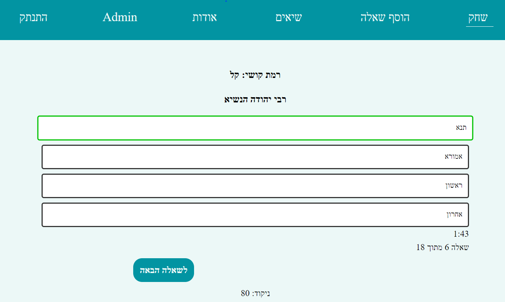

# Questioneer using Next + tRPC + XState + Vercel

The [original repo](https://github.com/shvushon/hahamim) was created using vanilla js and firebase.
I've converted it in [this repo](https://github.com/NoamLoewenstern/hahamim-quiz) to use the [T3 Stack](https://create.t3.gg/) + [XState](https://stately.ai/docs/xstate-v5).

## Tech Stack:

<!-- Variables -->

[deploy-url]: https://hahamim-quiz.vercel.app/
